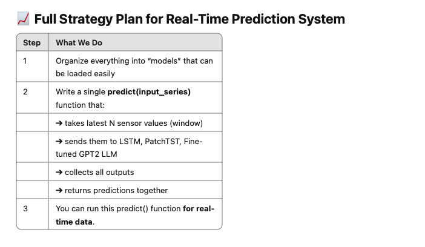

full strategy plan of real-time prediction system

🧠 Simple System Architecture

New Real-Time Sensor Input (latest 96 points)
        ↓
Predict Function
        ↓
 ┌─────────────┬─────────────┬─────────────┐
 │   LSTM      │ PatchTST     │ Fine-Tuned LLM │
 └─────────────┴─────────────┴─────────────┘
        ↓
 Predictions from All Models
        ↓
 Compare / Save / Alert / Visualize